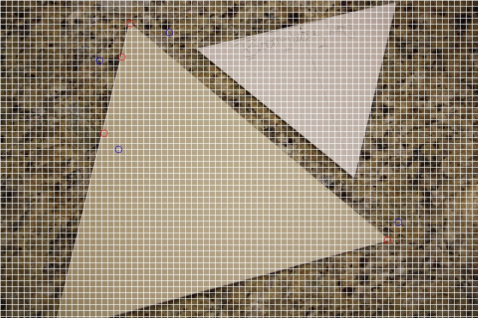
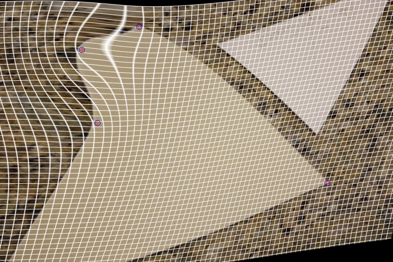

# Thin-plate-spline (TPS) warp
## Warp-image-TPS （python）
- Using opencv to implement ThinPlateSpline
- If it happens the error "cv2.createThinPlateSplineShapeTransformer() not found", please install opencv-contrib-python with the command below
```python
pip3 install opencv-contrib-python
# or use below code image for faster download if you are in China
pip3 install opencv-contrib-python -i https://pypi.tuna.tsinghua.edu.cn/simple
```
- There is a bug for function tps.applyTransformation() which only accepts np.float32 data type

## TPS-Warp (Matlab)
- see mytest.m as an example

## Example
- For convenience, we also provide an image named "1.jpg" for test TPS warping.
- An image warping example



